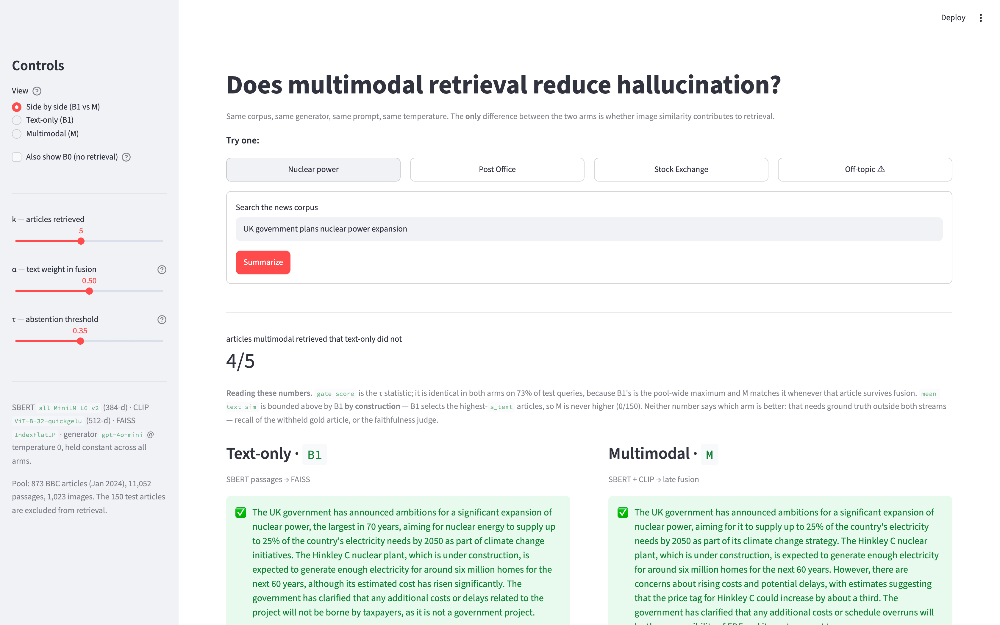

# Multimodal RAG for Factual News Summarization

Does grounding a news summarizer in **text and image evidence** reduce unsupported
claims compared with text-only retrieval? This ECE 1508 project builds a controlled
retrieval-augmented generation (RAG) pipeline over a January 2024 BBC News corpus and
tests where multimodality helps, does nothing, or introduces risk.

## Executive summary

The inherited `main` branch established the core result: retrieval greatly improves
factual grounding, but caption-mediated multimodality does not outperform text RAG.
The `research/end-to-end-multimodal` branch extends that work with duplicate-safe data
roles, actual image pixels in the generator, stronger retrieval baselines, a wrong-image
stress test, a frozen held-out comparison, and an independent evidence-label audit.

The final answer is conditional. **Across the full 150-article final-test role every
paired comparison favours the multimodal systems, and the complete pixel pipeline beats
text-only RAG by ~3.3 points (p=0.043, uncorrected and post hoc) — but no comparison
survives correction for the six tests reported, and both prespecified comparisons are
null, so this is a direction, not an established effect.** Text remains the dominant
evidence source, and strong lexical retrieval leaves little headroom for image retrieval
on this corpus.

An earlier 20-article run of the same frozen protocol reported the *opposite* sign on
M − B1. Enlarging the sample to the full role is what separated that artifact from the
signal; see [What the small sample cost](#what-the-small-sample-cost).

**Nothing is trained or fine-tuned.** SBERT and CLIP are frozen encoders, FAISS stores a
searchable corpus index, and generation/judging use hosted inference.

## What changed from `main` to the research branch

| Area | Inherited from `main` | Added in this branch |
|---|---|---|
| Corpus | 1,023 BBC text-image pairs | Duplicate and near-duplicate audit |
| Data roles | Random 873 pool / 150 test split | Group-safe 707 pool / 166 development / 150 final split |
| Multimodality | CLIP retrieval; generator sees captions | `M_vision`; generator receives actual JPEG pixels |
| Systems | B0, B1, M, M_nocap | M_vision and controlled wrong-image condition |
| Retrieval | Dense text and late fusion | Development-only α selection, RRF, TF-IDF, and reranking |
| Evaluation | Recall, claim faithfulness, caption ablation | Pixel attribution, stress testing, frozen final comparison |
| Judge | Cross-provider inherited evaluation | OpenAI-only image-aware judge with separated text/pixel checks |
| Validation | Blind 50-claim sheet exported | 50-claim AI-assisted audit and agreement analysis |
| Cost control | Cached calls | Persistent ledger and code-enforced $8 extension ceiling |

Labels used below:

- **Inherited:** completed on `main` and retained as the historical baseline.
- **Branch:** added during the end-to-end multimodal extension.
- **Final:** frozen result used for the project conclusion.

## Headline results and insights

### Inherited baseline

| System | Evidence | Faithfulness | Hallucination |
|---|---|---:|---:|
| B0 | No retrieval | 0.243 | 0.757 |
| B1 | Text passages | **0.901** | **0.099** |
| M | Fused retrieval + captions | 0.886 | 0.114 |

Retrieval cut hallucination by approximately **3.7×**. M did not improve over B1:
paired M − B1 = −0.015, 95% CI [−0.043,+0.013], p=0.252. Separate retrieval and
caption ablations were also null.

### Frozen end-to-end pixel comparison

The frozen protocol was executed twice: on a 20-article category-balanced sample
(E12) and, once E12's intervals proved uninformative, on every article in the
150-item final-test role (E12b). Nothing was re-selected between the two runs — k,
α, τ, the prompt, the generator, the decoding parameters and the judge are all read
from `configs/final_research.json`.

| Final held-out system | Usable faithfulness | Usable items |
|---|---:|---:|
| B1: text RAG | 0.864 | 77 |
| M: fused retrieval + captions | 0.874 | 80 |
| M_vision: M + actual pixels | **0.898** | 84 |

Paired differences over the full role:

| Comparison | Cut | n | Difference | 95% CI | p |
|---|---|---:|---:|---|---:|
| M − B1 *(prespecified)* | usable | 75 | +0.0188 | [−0.016,+0.059] | 0.642 |
| M_vision − M *(prespecified)* | usable | 80 | +0.0254 | [−0.003,+0.056] | 0.102 |
| M_vision − B1 **(post hoc)** | usable | 75 | **+0.0348** | [+0.002,+0.071] | 0.057 |
| M_vision − B1 **(post hoc)** | nonhard | 98 | **+0.0330** | [−0.000,+0.067] | **0.043** |

`configs/final_research.json` freezes *adjacent* paired comparisons as primary.
M_vision − B1 skips a rung and was added after the data was seen, so it is post hoc
and cannot carry the conclusion on its own — it is reported because it is the
comparison the accumulated effect shows up in, not because it was predicted.

All six comparisons are positive and the two usability cuts agree in sign. The only
one approaching significance is the full pixel pipeline against text-only RAG:
+3.3 to 3.5 points, win/loss 41/22 and 31/17. Each individual step is null
(B1→M p≈0.7, M→M_vision p=0.10–0.52) and contributes roughly half the total.

**This is not an established effect.** Six comparisons are reported without
multiplicity correction, and Bonferroni would require p < 0.008. The bootstrap
interval and the Wilcoxon test disagree at the margin in both cuts, which is what a
borderline result looks like. Confirming M_vision − M at 80% power needs 224 pairs,
and the final-test role is exhausted at 150 articles — more pairs require a larger
corpus, not a re-run.

7.1% of supported M_vision claims received independent support from both text and
pixels; no supported claim required pixels alone.

### What the small sample cost

E12's 20-article run supported the opposite conclusion:

| Comparison | E12 (n=12) | E12b (n=75) |
|---|---:|---:|
| M − B1 | −0.0405 | **+0.0188** |
| M_vision − M | +0.0366 | +0.0254 |

M − B1 flips sign, so E12's apparent "fusion hurts faithfulness" was an artifact of
n=12. E12 also had M_vision − M pointing opposite ways in its two usability cuts
(+0.037 usable, −0.015 nonhard) — a signature of noise that disappears at the full
sample. Enlarging the sample improved the detectable-effect floor 1.3–2.2×
(MDE 0.063–0.094 → 0.043–0.054) for $0.92 of hosted inference.

### Development versus final evidence

| Evaluation | M_vision − M | Interpretation |
|---|---:|---|
| Targeted 12-case development diagnostic | +0.205, CI [+0.057,+0.427] | Shows possible benefit conditions; selected for visual sensitivity |
| Frozen 150-article held-out comparison, E12b | +0.0254, CI [−0.003,+0.056] | Final estimate; average improvement not established |

This gap is a central insight: an enriched diagnostic can reveal a mechanism while
substantially overstating its average population effect.

### Main conclusions

1. Retrieval is the largest contributor to factual grounding.
2. Caption-mediated multimodality does not beat text RAG in this setting.
3. Actual pixels shift faithfulness in a consistently positive direction, but **both
   prespecified comparisons are null**. The full pipeline beats text-only RAG by ~3.3
   points at the edge of significance, and that comparison is post hoc and uncorrected.
4. Image weight must be restrained; equal fusion and pure image retrieval underperform.
5. Strong lexical cues create a retrieval ceiling that masks potential visual benefit.
6. Incorrect images can reduce faithfulness, although the observed harm is case-dependent.

## How the system works

```text
User query
   ├── SBERT text query ──► text FAISS index ──► text similarity
   └── CLIP text query ───► image FAISS index ─► image similarity
                                  │
                   min-max normalization + late fusion
                                  │
               top-5 articles, passages, captions and JPEGs
                                  │
             grounded GPT-4o-mini summary or abstention
                                  │
                    blind atomic-claim decomposition
                                  │
      GPT-5.6 Luna text verification + separate pixel verification
                                  │
          faithfulness, support modality, coverage and uncertainty
```

SBERT `all-MiniLM-L6-v2` produces 384-dimensional passage embeddings. CLIP
`ViT-B-32-quickgelu` produces 512-dimensional image embeddings. Both use FAISS
`IndexFlatIP`. The selected multimodal retrieval score is:

```text
score = 0.75 × normalized_text_similarity
      + 0.25 × normalized_image_similarity
```

### Controlled system ladder

| System | Retrieval | Generator evidence | What the comparison isolates |
|---|---|---|---|
| B0 | None | Query only | Hallucination ceiling |
| B1 | Dense text | Text passages | Value of text retrieval |
| M_nocap | Text-image fusion | Text passages | Image-fused retrieval |
| M | Same fused retrieval | Text + captions | Caption contribution |
| M_vision | Same M retrieval | Text + captions + pixels | Actual pixel contribution |
| M_conflict | Same text evidence | Text + incorrect pixels | Visual misgrounding risk |

For M versus M_vision, retrieval, article order, passages, captions, prompt, model,
decoding, and seed are held fixed. Only the corresponding image blocks are added.

## Data and experimental validity

| Property | Value |
|---|---|
| Source | Hugging Face `RealTimeData/bbc_news_alltime`, `2024-01` |
| Raw articles | 1,562 |
| Clean text-image pairs | 1,023 |
| Text passages | 11,052 |
| Images | 1,023 JPEGs, approximately 38 MB |
| Inherited roles | 873 retrieval pool / 150 test |
| Group-safe research roles | 707 pool / 166 development / 150 final test |
| Frozen final sample | 20 cases; four from each of five declared section families |

The branch audited character n-gram text similarity, exact image hashes, and image
dHash. It found 102 candidate duplicate edges, including 20 crossing the inherited
split. Research roles were rebuilt by connected duplicate groups; zero detected E04
edges cross the new roles.

The inherited 150 test items had already been used for α and prompt exploration, so
the branch treats them as development data. Final configuration choices were made
before running the separate 20-case frozen sample. The primary final statistic is
paired macro claim faithfulness with 10,000 bootstrap resamples.

## Experiment and test journey

| Stage | Origin | Question or test | Outcome | Decision | Insight |
|---|---|---|---|---|---|
| Corpus cleaning and split | Inherited | Can BBC text-image pairs support a controlled RAG study? | 1,023 clean pairs; no ID/headline overlap | **KEEP** | Small but complete paired corpus |
| SBERT/CLIP + FAISS | Inherited | Can both modalities be searched efficiently? | Indexes verified; fused query about 21 ms in inherited benchmark | **KEEP** | Retrieval is practical on CPU |
| B0/B1/M generation | Inherited | Does retrieval reduce hallucination? | B1 0.901 vs B0 0.243 faithfulness | **KEEP** | Retrieval is the dominant improvement |
| Caption ablation | Inherited | Do captions or changed retrieval explain M? | Both isolated effects statistically null | **NULL / KEEP** | Captions did not add measurable grounding |
| Streamlit demo | Inherited | Can the comparison be inspected interactively? | Side-by-side retrieval, prompts, evidence and abstention states | **KEEP** | Useful qualitative interface, not causal evidence |
| Duplicate audit, E04 | Branch | Does the inherited split contain near-duplicate leakage? | 20 candidate edges crossed roles | **KEEP / FIX** | Random article splits were not group-safe |
| Group-safe roles, E05 | Branch | Can tuning and final evidence be separated? | 707/166/150 roles; zero detected crossing edges | **KEEP** | Cleaner held-out evaluation |
| Actual-pixel arm, E06 | Branch | Can the generator consume retrieved pixels directly? | M_vision transport, caching and parity checks passed | **KEEP** | Closes the main caption-only limitation |
| Fusion selection, E07 | Branch | Which image weight works on development? | α=0.75 Recall@5 0.940 vs dense text 0.927 | **KEEP α=0.75** | Images are complementary only at low weight |
| Lexical/reranking, E08 | Branch | Are stronger text baselines competitive? | TF-IDF Recall@5 1.00, MRR 0.960 | **KEEP AS CEILING** | Questions contain strong lexical cues |
| Visual diagnostic, E09/E10 | Branch | Under image-sensitive conditions, do pixels help? | M_vision − M +0.205 on nine paired cases | **DIAGNOSTIC ONLY** | Pixels can help when evidence is visibly informative |
| Wrong-image stress, E11 | Branch | Can incorrect pixels misground the model? | 0.983 clean vs 0.927 wrong-image faithfulness | **KEEP** | Visual harm is real but case-dependent |
| Frozen comparison, E12 | Branch / Final | Does the diagnostic gain generalize? | +0.0366 on 12 pairs; CI crosses zero; cuts disagree in sign | **SUPERSEDED BY E12b** | n=12 could not resolve any outcome |
| Full-sample rerun, E12b | Branch / Final | Same frozen protocol on all 150 final-test articles | Prespecified comparisons null; post hoc M_vision−B1 +0.0330, p=0.043 | **FINAL / BORDERLINE** | Direction consistently positive; not multiplicity-corrected |
| Evidence audit, E13a | Branch | Does a second blind review agree with the judge? | 88% agreement; κ=0.672; modality agreement 86% | **KEEP AS SECONDARY** | Reasonable automated consistency, not human validation |
| Literal human validation, E13b | Missing | Has a human independently validated the judge? | Not completed | **OUTSTANDING** | Required before claiming human-validated faithfulness |

Full protocols, null results, decisions, and artifacts are recorded in
[`docs/research_log.md`](docs/research_log.md).

## Evaluation structure

| Level | Metrics | Question answered |
|---|---|---|
| Retrieval | Recall@1/5/10, MRR, rescues, harms | Did retrieval find the withheld gold article? |
| Generation | Usable coverage, hard/soft refusal, length | Did the system answer? |
| Grounding | Claim faithfulness, hallucination, modality | Did each claim stay within its evidence? |
| Mechanism | Text-only, image-only, both, unsupported | Which evidence stream supported the claim? |
| Robustness | Correct-image vs wrong-image delta | Can conflicting pixels cause harm? |
| Uncertainty | Paired differences and bootstrap CI | Is an observed mean change reliable? |
| Audit | Agreement, Cohen's κ, confusion matrix | Does a second review reproduce judge decisions? |

Recall and faithfulness are deliberately separate. Recall evaluates retrieval against a
gold article outside both score streams; faithfulness evaluates whether the generator
stays within the evidence it actually received.

### Independent evidence-label audit

The 50-row audit labeled 39 claims supported and 11 unsupported; three supported
claims received `both` modality labels. Against the frozen judge it achieved 44/50
agreement, Cohen's κ 0.672, and 86% modality agreement.

The audit was AI-assisted and is retained under `outputs/validation_audit/` with
provenance inside the workbook. It is secondary automated agreement evidence, **not a
human-subject validation result**. A future human reviewer must receive a fresh blind
copy with the existing label fields cleared.

## Overall status

| Component | Status | Notes |
|---|---|---|
| Environment and corpus | ✅ Complete | Pinned setup and committed BBC corpus |
| Text/image embeddings and indexes | ✅ Complete | SBERT, CLIP and FAISS |
| Text RAG and caption-mediated RAG | ✅ Complete | B1, M_nocap and M |
| Actual-pixel multimodal RAG | ✅ Complete | M_vision |
| Streamlit demo | ✅ Complete | Inherited B1/M comparison UI |
| Duplicate audit and group-safe roles | ✅ Complete | E04–E05 |
| Retrieval and reranking experiments | ✅ Complete | E07–E08 |
| Pixel mechanism and stress tests | ✅ Complete | E09–E11 |
| Frozen final evaluation | ✅ Complete | E12, rerun on the full role as E12b |
| AI-assisted evidence audit | ✅ Complete | E13a |
| Literal blind human validation | ⬜ Missing | E13b |
| Public deployment | ◐ Partial / optional | Local Streamlit app is complete |
| Course report and slides | ⬜ Separate deliverables | Not part of the code pipeline |

## Repository structure

```text
app/                         Streamlit interface
configs/                     Frozen research configuration
data/
  processed/                 Inherited pool/test/query artifacts
  research/                  Group-safe role manifest
  images/                    BBC JPEG corpus
docs/                        Architecture, decisions, logs and final write-up
outputs/validation_audit/    Reviewed audit workbook with provenance
results/
  experiments/               E04–E12b metrics and frozen outputs
src/                         Retrieval, generation and evaluation pipeline
tests/                       Lightweight invariants and regression tests
```

Important entry points:

| File | Role |
|---|---|
| `src/embed.py` | Clean bodies, chunk text, create SBERT/CLIP embeddings |
| `src/index.py` | Build, save and verify FAISS indexes |
| `src/retrieve.py` | Text and late-fusion retrieval |
| `src/generate.py` | Prompt construction, abstention and hosted generation |
| `src/audit_leakage.py` | Text/image duplicate screening |
| `src/build_research_split.py` | Group-safe research-role construction |
| `src/research_retrieval_eval.py` | Development fusion selection |
| `src/research_reranking_eval.py` | Lexical and reranking comparisons |
| `src/research_generation.py` | Development B1/M/M_vision generation |
| `src/research_evaluation.py` | Image-aware claim support evaluation |
| `src/research_stress.py` | Wrong-image stress experiment |
| `src/research_final.py` | Frozen 20-case generation runner (E12) |
| `src/research_scaleup.py` | E12's frozen protocol rerun on the full 150-item final-test role (E12b) — produces the headline result above |
| `src/final_analysis.py` | Free post-freeze retrieval/category analysis |
| `src/final_validation.py` | 50-claim agreement and κ calculation |

## Quickstart and reproducibility

```bash
bash scripts/setup.sh
source .venv/bin/activate

# Build local embeddings and indexes.
python src/embed.py
python src/index.py

# Inspect the system.
python -m src.retrieve
python -m src.generate
streamlit run app/streamlit_app.py
```

Python 3.10 or later is required. The corpus is committed; do not rebuild or resplit it
unless intentionally starting a new experiment, because role changes make results
incomparable with the frozen artifacts.

Free/local analysis commands:

```bash
python -m src.research_retrieval_eval --limit 10
python -m src.research_reranking_eval --limit 10
python -m src.final_analysis
python -m src.final_validation --validate
```

The committed results are already complete. Hosted generation and judging commands can
make API calls if their cached outputs are removed — this includes `src/research_final.py`
(E12) and `src/research_scaleup.py` (E12b, `python -m src.research_scaleup`), the scripts
behind the headline pixel-comparison numbers above. One OpenAI project key with Chat
Completions access is used for GPT-4o-mini generation and GPT-5.6 Luna judging; no
Anthropic key is required. The persistent ledger stops project code before the extension
exceeds its configured $8 ceiling.

## Limitation status after further development

### Resolved

- **[Resolved after further development] Caption-only generation.** M_vision now sends
  retrieved JPEG pixels to the generator and evaluator.
- **[Resolved in the inherited implementation] Video-player boilerplate.** `clean_body()`
  removes it before chunking; no detected boilerplate passages survive into the index.

### Partially addressed

- **[Partially addressed after further development] Split leakage.** Group-safe roles
  contain zero detected E04 crossing edges, but lightweight text similarity and image
  dHash cannot guarantee that every semantic duplicate was found.
- **[Partially addressed after further development] Moving evidence yardstick.** M versus
  M_vision fixes text evidence and changes only pixels. B1 versus M still retrieves
  different evidence and is judged against each arm's own context.
- **[Partially addressed after further development] Weak story categories.** E12b covers
  the whole final-test role, so per-family counts rose from one-to-four paired cases to
  the role's natural distribution — but that distribution is itself lopsided
  (74 society_culture, 30 international, 24 politics_conflict, 18 business/tech/science,
  4 sports, the corpus-wide total). Category results stay descriptive, now because the
  role is unbalanced rather than because the sample was small.

### Still open

- **High refusal and unusable-summary rates.** At the full role, 77/80/84 of 150 summaries
  per arm are usable (B1/M/M_vision), leaving 75 jointly usable B1–M pairs and 80 M–M_vision
  pairs. E12b removed the *absolute* sample-size problem but not the refusal rate itself:
  roughly 45% of items still produce a hard or soft refusal, and the τ gate fired zero
  times, so every refusal came from the model rather than the confidence threshold.
- **No literal human validation.** The AI-assisted audit checks consistency but does not
  satisfy a human-annotation claim.
- **Text-retrieval ceiling.** Dense text, fusion, and lexical retrieval all reach
  Recall@5=1.00 on E12's 20-query sample; TF-IDF also reaches 1.00 on development.
  Retrieval metrics were **not** recomputed for E12b's 150 queries, so whether the ceiling
  holds at the full role is untested — the E12b rerun covers generation and judging only.
- **Demo diagnostics are not causal evidence.** On-screen retrieval scores cannot decide
  which system generates more faithful claims.

### New limitations found after further development

- **Still underpowered, even at 150 articles.** E12b raised the paired sample from 12 to
  75–104 and the detectable-effect floor is now 0.043–0.054, but the observed effects are
  0.005–0.035. Confirming M_vision − M needs 224 pairs and the final-test role is
  exhausted, so further power requires a larger corpus.
- **Six uncorrected comparisons.** The p=0.043 headline would not survive Bonferroni
  (threshold 0.008). `configs/final_research.json` freezes *adjacent* paired comparisons
  as primary; M_vision − B1 was added afterwards and must be read as post hoc.
- **Rare measurable pixel contribution.** Only 7.1% of supported M_vision claims receive
  `both` support and none require pixels alone.
- **Development enrichment can exaggerate gains.** The targeted +0.205 result fell to
  +0.0254 on the full frozen sample.
- **Generation is not reproducible run to run.** With byte-identical prompts, temperature 0
  and a fixed seed, 43 of 60 regenerated summaries differed in wording (mean character
  similarity 0.58). Refusal *classification* stayed stable (58/60) and the paired sample
  composition was unchanged, so the comparison holds — but run-to-run variance is a real
  noise source inside every per-item score, and E12's exact numbers cannot be reproduced
  by re-running it.
- **Wrong-image evidence is limited.** The stress result comes from five cases.
- **Single outlet and month.** BBC News from January 2024 limits external validity.
- **Same-provider generation and judging.** GPT-4o-mini and GPT-5.6 Luna are different
  models but may share correlated provider/model-family biases.
- **Hosted inference dependence.** Sustained local vision-language inference was not
  evaluated on the available laptop because of thermal constraints.
- **Generation latency was not systematically recorded.** Retrieval and cost are logged,
  but full hosted latency cannot be reconstructed after the run.

## Efficiency and cost

| Item | Observed value |
|---|---:|
| Embedding build | Approximately 40 seconds with two CPU threads |
| Median final retrieval | 35 ms/query after loading |
| Index and embedding artifacts | Approximately 38 MB |
| Research-extension API ledger | $0.922 across 1,008 successful calls |
| ├ through E13a (20-article final sample) | $0.208 across 214 calls |
| └ E12b full 150-article rerun | $0.714 across 794 calls |
| Software budget ceiling | $8 against a $10 prepaid balance |
| Identical cached reruns | $0 additional API cost |
| Measured provider limits (2026-08-09) | 10,000 RPM / 200,000 TPM; TPM is the binding one |

The inherited provider setup recorded $7.24 before the extension. The extension ledger
is separate and conservative: input tokens are priced at the uncached rate.

## Demo

The inherited Streamlit interface provides side-by-side B1/M summaries, retrieved
articles, thumbnails, score components, literal prompts, and three abstention states.
It is a qualitative inspection tool rather than a replacement for frozen evaluation.



## Documentation map

- [`docs/setup_guide.md`](docs/setup_guide.md) — installation and troubleshooting
- [`docs/architecture.md`](docs/architecture.md) — system contracts and invariants
- [`docs/baseline_summary.md`](docs/baseline_summary.md) — inherited state at branch point
- [`docs/experimental_contract.md`](docs/experimental_contract.md) — research questions and freeze rules
- [`docs/research_log.md`](docs/research_log.md) — complete experiment and decision ledger
- [`docs/final_results.md`](docs/final_results.md) — concise frozen findings
- [`docs/decisions.md`](docs/decisions.md) — inherited design decisions
- [`docs/future_work.md`](docs/future_work.md) — ranked next steps

## Implementation notes

- On macOS, rerun `bash scripts/fix_openmp.sh` after package changes involving Torch,
  FAISS or scikit-learn; OpenMP conflicts can crash the first FAISS search.
- CLIP must load as `ViT-B-32-quickgelu`, not `ViT-B-32`. The wrong architecture runs
  successfully but changes retrieval materially.
- Keep `torch.no_grad()` scoped to forward passes. Torch gradient state is thread-local,
  so a global change can break repeated Streamlit runs.
- Keep OpenAI billing auto-reload disabled and retain the persistent software budget
  ledger when running any new hosted experiment.
